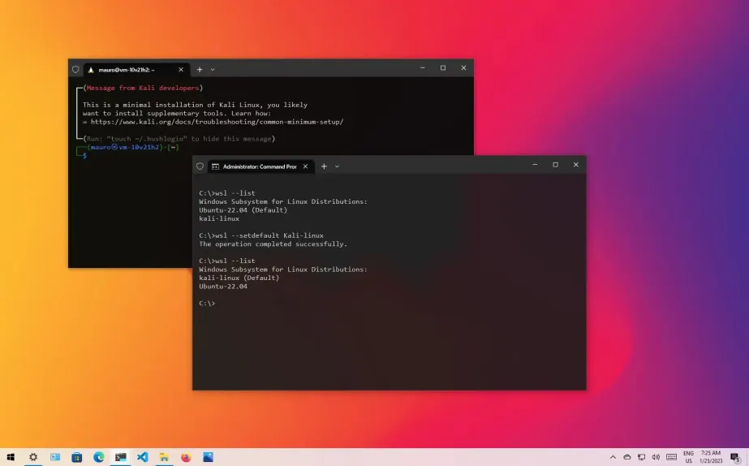
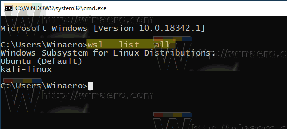
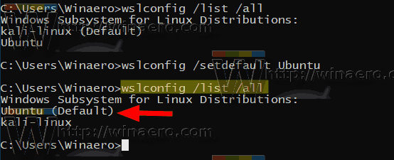
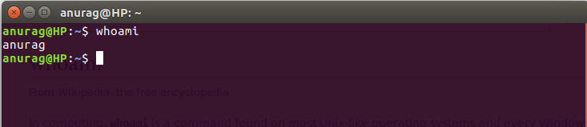
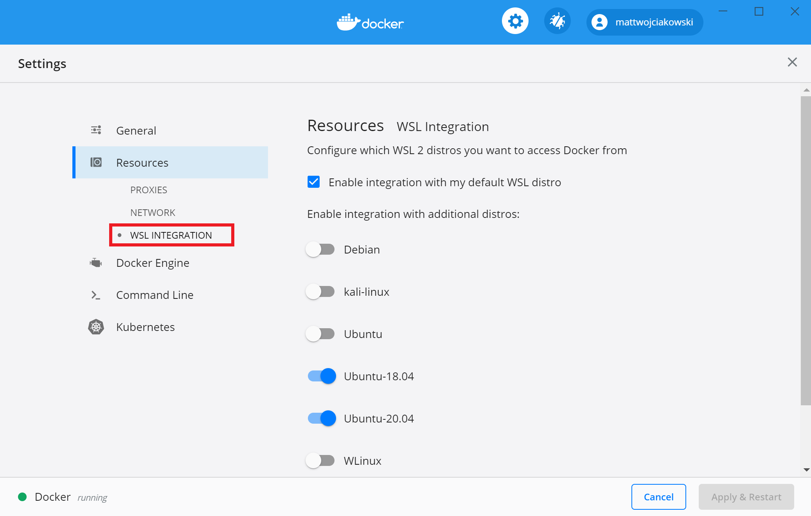

## Install WSL
Run this command
```
wsl.exe --install --d Ubuntu-22.04
```

> NOTE: In the New password and Retype new password sections, when you type, the characters will not be displayed, but don't worry, they are only hidden when you type.

Show all versions you have in your device:
```
wsl -l -v
```


To remove the distribution, use the command
```
wsl --unregister Ubuntu-22.04
```

The current default WLS distro is labeled (Default). To set a new default WSL distro, execute the command:
```
wsl --setdefault Ubuntu-22.04
```


Finally, try this command
```
wsl
```
The system will login to `wsl`, please fill password have been created


## Install source to WSL
Create workspace follow if it's not exists, use the command:
```
mdkir workspace
```

Copy source to wsl: use the command
```
cd ~/workspace && cp -R /mnt/<project_folder> <project_name_in_wsl> 
```
Please change 
- `<project_folder>` to your project path Ex: `/d/workspace/my_project `
- `<project_name_in_wsl>` to your project name Ex: `my_project`

Reset permissions for the project, use the command:
```
cd ~/workspace/<project_name_in_wsl> && chown -R <your_wsl_name>: .
```
Please change
- `<project_name_in_wsl>` to your project name Ex: `penkar`
- `<your_wsl_name>` to your wsl username Ex: `ubuntu_user`

To view username in wsl, use this command:
```
whoami
```


## Install docker to WSL
Please follow this link [https://learn.microsoft.com/en-us/windows/wsl/tutorials/wsl-containers ](https://learn.microsoft.com/en-us/windows/wsl/tutorials/wsl-containers#install-docker-desktop)



After setup please try:
- To confirm that Docker has been installed, open a WSL distribution (e.g. Ubuntu) and display the version and build number by entering: `docker --version`

- Test that your installation works correctly by running a simple built-in Docker image using: `docker run hello-world`
